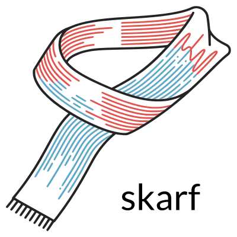

<!--  -->

  

skarf (**s**ci**k**it **a**uto**r**egressive models for **f**unctional connectivity) is a Python package for regularized vector autoregressive (VAR) time series modeling built on top of [scikit-learn](https://scikit-learn.org).
